 

# LVMC DSPIC33CK256MP508 AN1078

## INTRODUCTION

This document describes the setup requirements for running the Sensor-less FOC algorithm with a Sliding Mode Observer, which is referenced in AN1078 “Sensorless Field Oriented Control of a PMSM” and to implement three phase currents reconstruction algorithm using DC bus Current,which is referenced in AN1299“Single-Shunt Three-Phase Current Reconstruction Algorithm for
Sensorless FOC of a PMSM” using a dsPIC33CK Low Voltage Motor Control Board.

The demonstration is configured to run on the dsPIC33CK Low Voltage Motor Control Board in both Internal and External Op Amp configuration with the dsPIC33CK256MP508.

## FIELD ORIENTED CONTROL (FOC)

In case of the PMSM, the rotor field speed must be equal to the stator (armature) field speed (i.e., synchronous). The loss of synchronization between the rotor and stator fields causes the motor to halt. Field Oriented Control (FOC) represents the method by which one of the fluxes (rotor, stator or air gap) is considered as a basis for creating a reference frame for one of the other fluxes with the purpose of decoupling the torque and flux-producing components of the stator current. The decoupling assures the ease of control for complex three-phase motors in the same manner as DC motors with separate excitation. This means the armature current is responsible for the torque generation, and the excitation current is responsible for the flux generation. In this application note, the rotor flux is considered as a reference frame for the stator and air gap flux.

PMSM needs accurate info about rotor flux angle (position). This can be achieved using physical sensor (encoder or resolver) or with specialized algorithm called estimators (sensorless technique). This demo code uses sliding mode observer (SMO) to estimate the rotor position. For more details, please refer to the application note "AN1078" from Microchip website.

  
## Hardware Connection and Running the Demo Code

## Motor Control Application Firmware Required for the Demonstration
To clone or download this application from Github, go to the [main page of this repository](https://github.com/microchip-pic-avr-solutions/lvmc-dspic33ck256mp508-an1078) and then click Clone button to clone this repository or download as zip file.

## Software Tools Used for Testing the firmware
- MPLAB® X IDE v5.50 or later
- MPLAB® XC16 Compiler v1.70
- MPLAB® X IDE Plugin: X2C-Scope v1.30 or later
> **_NOTE:_**
>The software used for testing the firmware prior to release is listed above. It is recommended to use the version listed above or later versions for building the firmware.
## Hardware Tools Required for the Demonstration
- dsPIC33CK Low Voltage Motor Control Board, Part-No. [DM330031](https://www.microchip.com/developmenttools/ProductDetails/PartNO/DM330031)
- 24V Power Supply, Part-No. [AC002013](https://www.microchipdirect.com/dev-tools/AC002013)
- 24V 3-Phase Brushless DC Motor, Part-No. [AC300020](https://www.microchip.com/en-us/development-tool/AC300020)
- Microchip Programmer tool - MPLAB PICkit 4 In-Circuit Debugger, Part-No. [PG164140](https://www.microchip.com/en-us/development-tool/PG164140)
   
> **_NOTE:_**
> All items listed under the section Hardware Tools Required for the Demonstration are available at [microchip DIRECT](https://www.microchipdirect.com/)

## Hadware Setup

This section describes hardware setup required for the demonstration. Motor phase current feed-backs needed by the firmware are amplified by the operational amplifiers.

If the amplifiers that are internal to the dsPIC33CK256MP508 are used, then that configuration is called internal amplifier configuration. If external amplifiers are used, then that configuration is called as external amplifier configuration.

1. 
Perform the following modifications based upon amplifier configuration. By default, Board is configured for Internal OP-AMP Configuration.

    - For running the motor in internal op amp configuration make sure that resistors R125, R133, R141 are populated and R121, R129, R137 are unpopulated. Also ensure internal amplifiers are configured and enabled.
    - For running the motor in external amp configuration make sure that resistors R121, 
      R129, R137 are populated and R125, R133, R141 are unpopulated. Also disable internal amplifiers in the firmware.

2. Connect the three phase wires from the motor to PHA, PHB, and PHC terminals of connector J14(there is no specific order), provided on the dsPIC33CK Low Voltage Motor Control Board.
 

 

  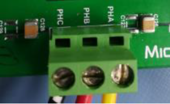

 
 Figure 1  LVMC motor Connection diagram

3.	Plug in the 24V power supply to connector J1 or J2 provided on the dsPIC33CK Low Voltage Motor Control Board.

 

  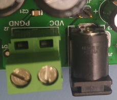

 
 Figure 2  LVMC Power Supply Connector

 

4.	The board has an on-board programmer ‘PICKIT™ On Board (PKOBv4)”, which can be used for programming or debugging dsPIC33CK256MP508 device. To use on-board programmer, connect a micro USB cable between Host PC and Connector J13 provided on the dsPIC33CK Low Voltage Motor Control Board.

  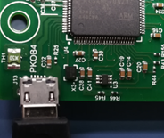

 
 Figure 3  LVMC PKOB4

 

5.	Alternatively, connect the Microchip programmer/debugger MPLAB PICkit 4 In-Circuit De-bugger to the Connector J10 of the dsPIC33CK Low Voltage Motor Control Board as shown below and to the Host PC used for programming the device. Ensure that PICkit 4 is connected in correct orientation.

  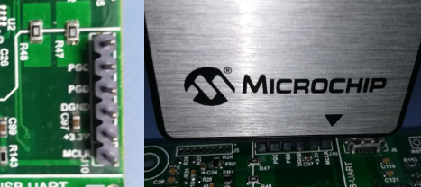

 
 Figure 4  LVMC Programming Connector

 
 

## SOFTWARE SETUP AND RUN
### Setup: MPLAB X IDE and MPLAB XC16 Compiler

Install MPLAB X IDE and MPLAB XC16 Compiler versions that support the device dsPIC33CK256MP508 and PKOBv4. The version of the MPLAB X IDE, MPLAB XC16 Compiler and X2C-Scope plug-in used for testing the firmware are mentioned in the section Software Tools Used for Testing the firmware. To get help on 

- MPLAB X IDE installation, refer [link](https://microchipdeveloper.com/mplabx:installation)
- MPLAB XC16 Compiler installation steps, refer [link](https://microchipdeveloper.com/xc16:installation)

If MPLAB IDE v8 or earlier is already installed on your computer, then run the MPLAB driver switcher (It is installed when MPLAB®X IDE is installed) to switch from MPLAB IDE v8 drivers to MPLAB X IDE drivers. If you have Windows 7 or 8, you must run MPLAB driver switcher in ‘Administrator Mode’. To run the Device Driver Switcher GUI application as administrator, right click on the executable (or desktop icon) and select ‘Run as Administrator’. For additional details refer MPLAB X IDE help topic “Before You Begin: Install the USB Device Drivers (For Hardware Tools): USB Driver Installation for Windows Operating Systems”. 

### Setup: X2C - SCOPE

X2C - SCOPE is a MPLAB X IDE plugin that allows a developer to interact with an application while the application program is running. X2C-Scope enables you to read, write, and plot global variables (for motor control) in real time. It communicates with the target using the UART. To use X2C, the plugin must be installed:

- In MPLAB X IDE, select Tools>Plugins and click on the Available Plugins tab.
- Select X2C - SCOPE plug-in by checking its check box, and then click Install.
- Look for tool X2C - SCOPE under Tools>Embedded.

  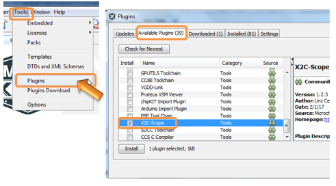

 
 Figure 5  X2C Scope Configuration

 
 

##  BASIC DEMONSTRATION
### Firmware Description

This firmware is implemented to work on Microchip’s 16-bit Digital signal controller (dsPIC® DSC) dsPIC33CK256MP508. 
For more information, see the dsPIC33CK256MP508 Family datasheet (DS70005349).

The Motor Control Demo application uses push button to start or stop the motor and poten-tiometer to vary speed of the motor.

This Motor Control Demo Application configures and uses peripherals like PWM, ADC, UART etc. required for implementing Sensor-less Field Oriented Control (FOC) of Permanent Magnet Synchronous Motor (PMSM) based on the motor control application AN1299 & AN1078.

For more details refer Microchip Application note AN1078 “Sensorless Field Oriented Control of a PMSM” and AN1299 “Single-Shunt Three-Phase Current Reconstruction Algorithm for Sensorless FOC of a PMSM” available at Microchip web site. 

> **_NOTE:_**
> The project may not build correctly in Windows OS if Maximum path length of any source file in the project is more than 260 characters. In case absolute path is exceeding or nearing maximum length, do any (or both) of the following:
 > - Shorten the name of the directory containing the firmware used in this demonstration. In this case, rename directory AN1078_dsPIC33CK256MP508_EXT_INT_OPAMP_LVMC to more ap-propriate shorter name. In case you renamed the directory, consider the new name while reading instructions provided in the upcoming sections of the document. 
> - Place firmware in a location, such that absolute path length of each file included in the projects does not exceed the Maximum Path length specified. 
For details, refer MPLAB X IDE help topic “Path, File and Folder Name Restrictions”.

### Basic Demonstration

Follow below instructions step by step to setup and run the motor control demo application:

1. 
 Start MPLAB X IDE and open (File>Open Project) the project pmsm.X with device selection dsPIC33CK256MP508.

  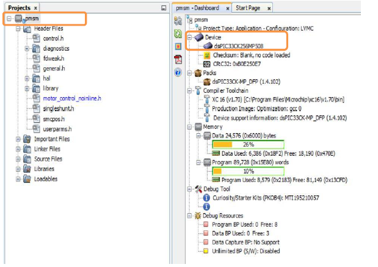

 
 Figure 6  IDE Device selection

 

2. 
Set the project pmsm.X as main project by right clicking on the project name and selecting “Set as Main Project” as shown. The project “pmsm” will then appear in bold.

 

  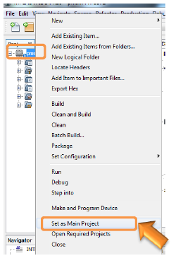

 
 Figure 7  IDE Project setup

 
	
3. 
Open userparams.h (under pmsm.X -> headerfiles) in the project pmsm.X  

    - Ensure that TUNING, OPEN_LOOP_FUNCTIONING, and TORQUE_MODE are not defined.

    - When internal amplifiers are used for current amplification (referred as ‘Internal Op Amp configuration’) then define INTERNAL_OPAMP_CONFIG.
  

  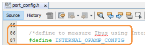

 
 Figure 8  Internal Op-Amp Confuiguration

 
    

    Otherwise if external amplifiers are used for current amplification (referred as ‘External Op Amp Configuration’) then undefine the macro INTER-NAL_OPAMP_CONFIG in userparams.h.

  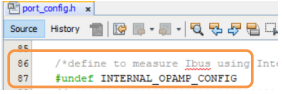

 
 Figure 9  External Op-Amp Confuiguration

4. 
Open userparams.h (under pmsm.X -> headerfiles) in the project pmsm.X and ensure SINGLE_SHUNT is undefined if dual shunt configuration is used for phase current measurement and demonstration 
 

  

  

 
 Figure 10  Dual Shunt Configuration

5. 
 For demonstration of FOC using single shunt reconstruction algorithm (i.e. reconstruction of phase currents from DC Bus Current), enable single shunt algorithm by defining the macro SINGLE_SHUNT in userparams.h (under pmsm.X -> headerfiles) part of the project pmsm.X. In this mode, reconstructed phase currents (from DC Bus current feedback) and actual phase currents (measured across phase shunt resistors) are available for comparison. By default, firmware is enabled to operate in single shunt con-figuration.

  

  

 
 Figure 11  Single Shunt Configuration

  
6. 
Right click on the project bldc.X and select “Properties” to open its Project Properties Dialog. Click the “Conf: [default]” category to reveal the general project configuration information.

    In the ‘Conf: [default]’ category window: 
    - Select the specific Compiler Toolchain from the available list of compilers. Please ensure MPLAB® XC16 Compiler supports the device dsPIC33CK256MP508. In this case “XC16(v1.70)” is selected. The compiler used for testing the firmware is listed in the section Software Tools Used for Testing the firmware.
    - Select the Hardware Tool to be used for programming and debugging. In this case, “MPLAB PKoB 4” is the selected programmer.
    - After selecting Hardware Tool and Compiler Toolchain, click button Apply

        

        

        
 Figure 12  Project Properties settings
        

7. 
	To build the project (in this case pmsm.X) and program the device dsPIC33CK256MP508, click “Make and Program Device Main project” on the toolbar.

  

  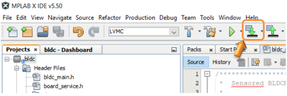

 
 Figure 13  Device Programming

  
8. 
		If the device is successfully programmed, LD10 (‘LED2) will be turned ON, indicating that the dsPIC® DSC is enabled.
 

9. 
		Run or Stop the motor by pressing the push button SW1. The function of the pushbutton SW1 (Run/Stop of the motor) is indicated by turning ON or OFF the LED1 (LD11).

  

  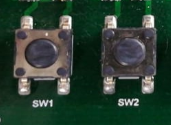

 
 Figure 14  Push buttons

 
10. 
	If desired, the motor speed can be varied using the potentiometer (labeled “POT1”).

  

  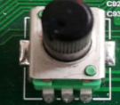

 
 Figure 15  Potentiometer

 
11.	
To enter the extended speed range (NOMINAL_SPEED_RPM to MAXIMUM_SPEED_RPM) press the push button SW2. Press the push button SW2 again to revert the speed of the motor to its normal speed (END_SPEED_RPM to NOMINAL_SPEED_RPM) range. 

12.	
Press the push button SW1 to stop the motor.

> **_NOTE:_**
>The macro definitions END_SPEED_RPM, NOMINAL_SPEED_RPM, and MAXIMUM_SPEED_RPM are specified in userparms.h file included in the project pmsm.X. The definitions NOMINAL_SPEED_RPM, and MAXIMUM_SPEED_RPM are defined as per the specification provided by the Motor manufacturer. Exceeding manufacture specification may lead to damage of the motor or(and) the board. 

## Data visualization through X2CScope Plug-in of MPLABX

The application firmware comes with initialization required to interface Controller with Host PC to enable Data visualization through X2C Scope plug-in. X2C-Scope is a third-party plugin for MPLAB X which facilitates real-time diagnostics.

1. Ensure X2C Scope Plug-in is installed. For additional information on how to set up a plug-in refer https://microchipdeveloper.com/mplabx:tools-plugins-available

2. 
To utilize X2C communication for this demonstration, a micro-USB connection is required between Host PC and dsPIC33CK Low Voltage Motor Control Board. PKob 4 Connector J13 can be used to communicate between Host PC and dsPIC33CK Low Voltage Motor Control Board, alternatively Connect a micro-USB cable from your computer to the J6 connector of the dsPIC33CK Low Voltage Motor Control Board.

 

  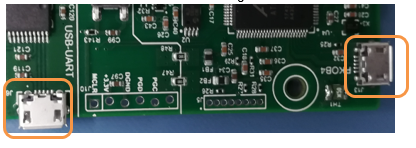

 
 Figure 16  X2C Interface

3.	
Ensure application is configured and running as described under Section Basic Demonstration by following steps 1 through 12.

4.	
Build the project pmsm.X. To do that right click on the project pmsm.X and select “Clean and Build”.

 

  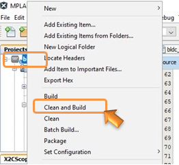

 
 Figure 17  Clean and Build

 
5.	
Please ensure that the checkbox “Load symbols when programming or building for pro-duction (slows process)” is checked, which is under the “Loading” category of the Project Properties window

 

  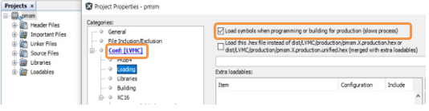

 
 Figure 18  Load Variables

6.	
To build the project (in this case pmsm.X) and program the device dsPIC33CK256MP508, click “Make and Program Device Main project” on the toolbar.

 

  

 
 Figure 19  Device Programming

7.	
Open the X2C window by selecting Tools>Embedded>X2CScope.

 

  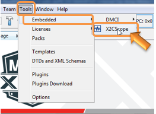

 
 Figure 20  X2C Selection

8.	
Open the X2CScope Configuration window and in “Select project” menu, select bldc project as shown.

 

  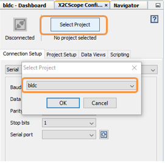

 
 Figure 21  X2C Project selection

9.	
Remote Communication needs to be established, as indicated in the following figure. Ensure the communication baud rate is set to 115200 as the same is set in the application firmware, while COM port used depends on the system settings. Refresh button lists the available COM Ports. Select the COM Port as per the connection.

 

  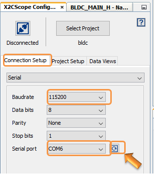

 
 Figure 22  X2C Connection setup

10.	
Once COM port detected, click on “Disconnected”, and it will be turn into “Connected”, if the link is established as programmed.

  

  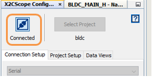

 
 Figure 23  X2C Connection Button

11.	
Set the “Project Setup” as shown below and click “Set Values”. Set Scope sample time as interval at which X2CScopeUpdate() is called. In this application it is every 20kHz (50µs).

 

  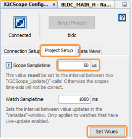

 
 Figure 24  X2C Project Setup

12.	
When the setup is established, click on open scope View (under sub window “Data Views”), this open Scope Window.

 

  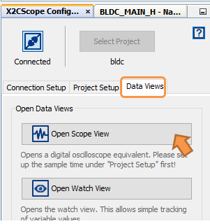

 
 Figure 25  X2C Dataview

    	     

13.	
In this window, select the variables that needs to be monitored. To do this, click on the source against each channel, a window Select Variables opens upon the screen. From the available list, the required variable can be chosen. Ensure check boxes Enable & Visible are checked for the variables to be plotted.

    To view data plots continuously, uncheck Single-shot. When Single-shot is checked it captures the data once and stops. The Sample time factor value multiplied with Sample time determines the time difference between any two consecutive data points on the plot.

 

  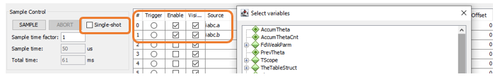

 
 Figure 26  X2C Datapoint selection

 

14.	
Click on SAMPLE, then X2C scope window shows variables in real time, which is updated automatically.

  

  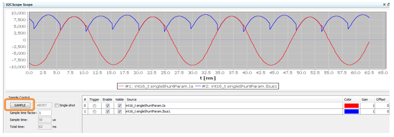

 
 Figure 27  X2C Sample

15.	
Click on ABORT to stop.

 

  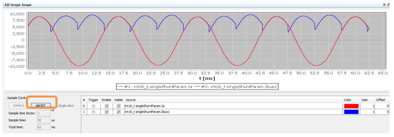

 
 Figure 28  X2C Abort

  
## REFERENCES:
For additional information, refer following documents or links.
1. AN1078 Application Note “Sensorless Field Oriented Control of a PMSM”
2. AN1299 Application Note “Single-Shunt Three-Phase Current Reconstruction Algorithm for Sensorless FOC of a PMSM”
3. dsPIC33CK Low Voltage Motor Control Board User’s Guide (DS50002927)
4. dsPIC33CK256MP508 Family datasheet (DS70005349).
5. Family Reference manuals (FRM) of dsPIC33CK256MP508 family
6. MPLAB® X IDE User’s Guide (DS50002027) or MPLAB® X IDE help
7. MPLAB® X IDE installation
8. MPLAB® XC16 Compiler installation

